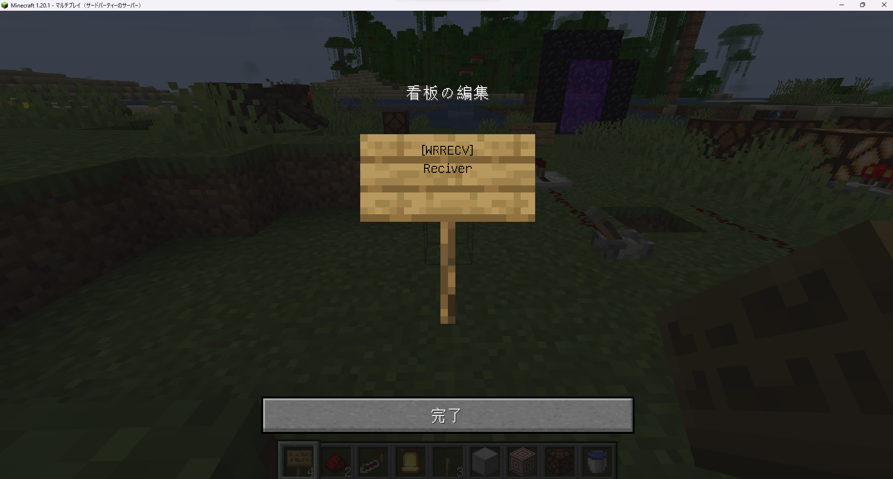
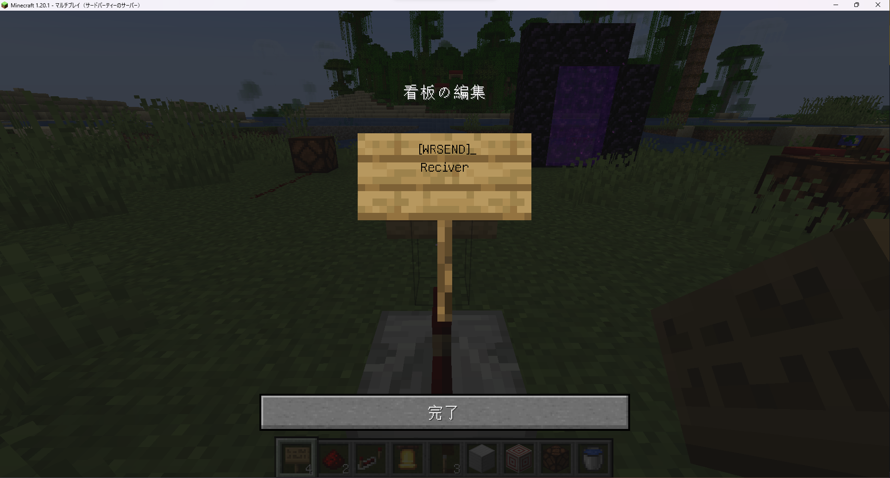

# WirelessRedstone
赤石にもワイヤレスの時代がやってきた！  
これからのレッドストーンは、直接接続しないでワイヤレスで制御しよう！

(長らくメンテナンスされていないBukkitPluginの「Wireless Redstone」が目に入って作りました)

## 使い方
### 受信機の作成
1. 看板を設置します。（種類は問いません）
2. 1行目に`[WRRECV]`と入力します。
3. 2行目に受信機の名前を入力します。
  
4. `[WR]: 受信機のポイント(受信機の名前)を作成しました！`と表示されれば成功です。

### 送信機の作成
1. 看板を設置します。（種類は問いません）
2. 1行目に`[WRSEND]`と入力します。
3. 2行目に制御したい受信機の名前を入力します。
  
4. `[WR]: 送信機のポイント(制御したい受信機の名前)を作成しました！`と表示されれば成功です。

### 制御方法
作成した送信機にレッドストーンリピーターで信号を入力すると、受信機がレッドストーントーチとなり、信号が出力されます。
